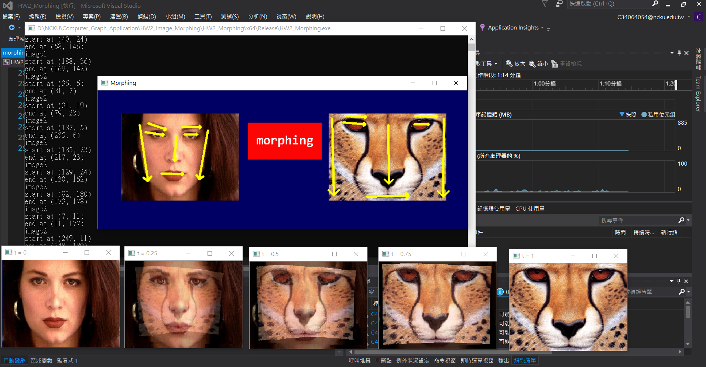

# Image_Morphing

### 作業環境: 

    Windows10 / Visual Studio 2015 / opencv 3.4.3

### 方法說明:

- 創建主視窗，包含兩張原圖及合成按鈕
- 採用 morphing 公式進行實作

#### single line-pair

#### multi line-pair

其中，dist的算法可分成三種:
1. dist = abs(v) , if 0<u<1
2. dist = |X'-P| , if u<0
3. dist = |X'-Q'| , if u>1

又a,b,p之值會影響結果，必須選一組合適的值 
    
### 操作說明:

步驟如下
1. 選擇Release x64 執行， 會先跑出含有兩張原圖的視窗
2. 繪製方式為在起點按下滑鼠右鍵不放，拖曳到目標點，放開右鍵
3. 先對左圖進行特徵線繪製
4. 再對右圖進行特徵點繪製
5. 繪製完成，按下中間morphing按鈕，產生結果

